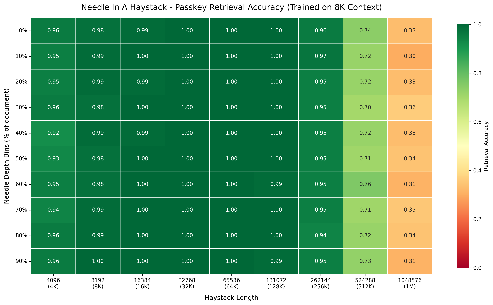
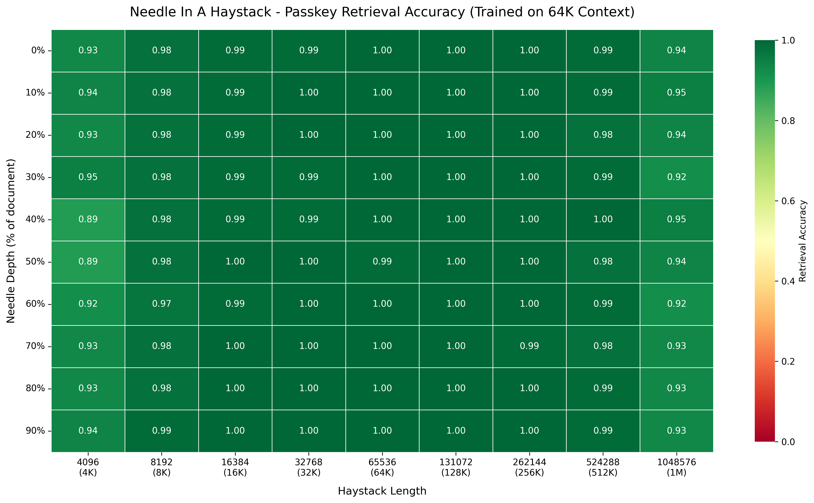
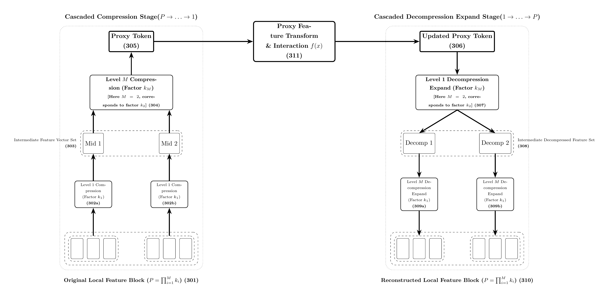
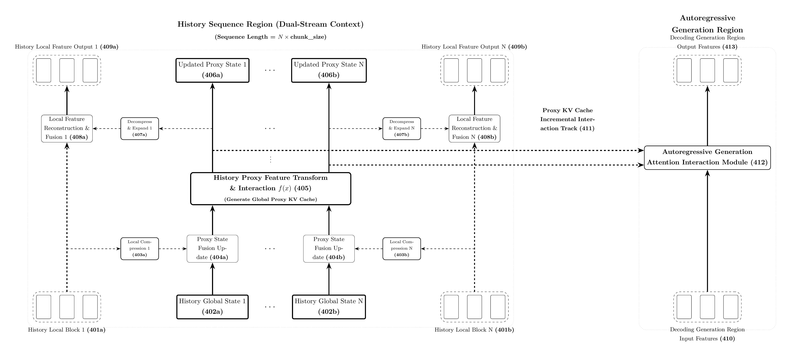
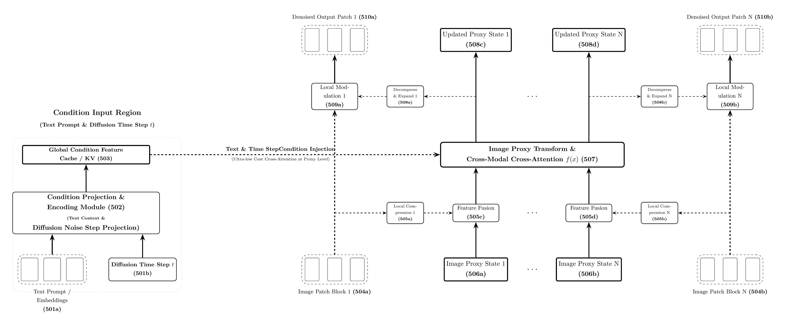

[English](README.md) | [简体中文](README_zh.md)

# ProxyFormer

arxiv: <https://arxiv.org/abs/2608.23463>

> **Carry global interaction with extremely short "Proxy Tokens", making ultra-long sequences and high-resolution generation possible under limited compute.**

ProxyFormer is a new neural network architecture designed for ultra-long sequences, high-resolution inputs, and long feature processing in arbitrary dimensions. It uniformly supports 1D text sequences, 2D images, 3D point clouds / voxels / spatio-temporal videos, and higher-dimensional tensors. By introducing the **Proxy Token** mechanism, it compresses long, high-resolution, or high-dimensional features into an extremely short proxy sequence and performs global attention interaction in the proxy feature space. This simultaneously reduces **computation** and **memory usage**, and natively supports **proxy-level KV Cache** acceleration. The entire architecture relies only on common operators such as rearrangement, linear projections, convolutions, and standard attention. It is simple to implement and does not require sparse indexers or custom CUDA kernels.

> 🔗 Source repository: <https://github.com/simonFelix-Ai/proxy-former.git>

This repository is used to verify the usability and engineering feasibility of the ProxyFormer architectural idea. It includes:

- Training and evaluation of ultra-long-context **language models (LLMs)**;
- **NIAH / multi-needle in a haystack** long-text retrieval evaluation;
- **Image generation (JIT / JLT)** with Flow Matching and autoencoder training;
- Resource usage comparison experiments (VRAM / speed);
- A unified YAML-driven training and evaluation workflow.

---

## Table of Contents

- [Core Highlights](#core-highlights)
- [Quick Start](#quick-start)
- [Experimental Results](#experimental-results)
- [Architecture Design](#architecture-design)
- [Core Advantages](#core-advantages)
- [Evolution Path](#evolution-path)
- [Project Structure](#project-structure)
- [Configuration](#configuration)
- [Collaboration and Contact](#collaboration-and-contact)
- [Rights Statement](#rights-statement)

---

## Core Highlights

- 🚀 **Million-token extrapolation**: a model trained with a 64K window extrapolates to **1M (1,048,576) tokens** while retaining **92%–95%** multi-needle retrieval accuracy.
- ⚡ **Strong generalization elasticity**: a model trained with an 8K window can directly extrapolate to **256K (32×)** with accuracy above 94%.
- 🧠 **No more "lost in the middle"**: retrieval accuracy remains stable and consistent across 0%–100% depth ranges.
- 💾 **Lower computation and memory**: with compression ratio `r`, global attention computation drops to `(1/r)^2` of the original, and history activations/caches drop to `1/r`.
- ⚙️ **Proxy KV Cache**: autoregressive decoding only maintains a very short proxy history state, greatly reducing inference memory and latency.
- 🖼️ **Visual-generation friendly**: supports JIT (direct pixel generation) and JLT (latent-space generation) paradigms.
- 🌐 **Arbitrary-dimension generality**: the same chunking → compression → proxy interaction → decompression mechanism transfers to text, images, point clouds, voxels, videos, and higher-dimensional tensors.
- 🧩 **Simple implementation**: compression/decompression can be built with rearrangement, linear projections, and convolutions; proxy interaction reuses standard attention or SSM modules, with no complex indexers, block-sparse kernels, or custom CUDA operators.
- 📈 **Scaling-friendly**: the decoupled modular design allows flexible adjustment of compression ratio, channel width, and depth. Channel expansion also provides capacity headroom for further increasing the compression ratio.

---

## Quick Start

### Environment Setup

Python 3.10 with Conda is recommended:

```bash
conda create -n proxyformer python=3.10
conda activate proxyformer
pip install -r requirements.txt
```

### Data

- LLM experiments use **Wikitext-103-v1** by default; image experiments use **CIFAR-10 / MNIST / Tiny ImageNet**.
- On first run, datasets are downloaded automatically through HuggingFace `datasets` and cached under `out/dataset_cache/`.
- You can also modify `dataset_path` / `dataset_name` / `dataset_dir` in the YAML files to use local data.

### Weights and Training from Scratch

- Training/evaluation scripts load weights from `out/checkpoints/train/{experiment_name}/` by default (e.g., `ar.pth`, `fm.pth`, `ae.pth`, `fm.pth.ema`).
- To train **from scratch**, delete the weight files under the corresponding experiment directory, for example:

```bash
rm -rf out/checkpoints/train/llm_proxy_former_chat_wiki
```

- If trained weights are already available, place them at the corresponding paths and run evaluation directly.

> Note: weights are loaded from the local `out/checkpoints` directory. If this repository does not include pretrained weights, complete the corresponding training before evaluation.

### LLM Evaluation (WikiText PPL)

```bash
# ProxyFormer: with compressed history
python eval.py --config configs/llm/proxy_former/eval/1-chat_with_history_nope.yaml

# ProxyFormer: without history
python eval.py --config configs/llm/proxy_former/eval/2-chat_no_history_nope.yaml

# Base decoder-only baseline
python eval.py --config configs/llm/base/eval/1-chat-nope.yaml
```

### LLM Training

```bash
# ProxyFormer: train without history first, then with history
python train.py --config configs/llm/proxy_former/train/1-chat_no_history.yaml
python train.py --config configs/llm/proxy_former/train/2-chat_with_history.yaml
python train.py --config configs/llm/proxy_former/train/3-chat_with_history_nope.yaml

# Base decoder-only baseline
python train.py --config configs/llm/base/train/1-chat.yaml
python train.py --config configs/llm/base/train/2-chat-nope.yaml
```

### NIAH Long-Text Retrieval Evaluation

For a ProxyFormer trained with an 8K window, evaluate length by length:

```bash
python eval.py --config configs/niah/d_model_512/proxy_former/train_seq_len_8k/eval/histlen_8k_nkey_50_nope.yaml
...
```

The same applies to a 64K training window:

```bash
python eval.py --config configs/niah/d_model_512/proxy_former/train_seq_len_64k/eval/histlen_8k_nkey_50_nope.yaml
...
```

> The repository contains more `histlen_*` evaluation configurations; choose them as needed.

### NIAH Curriculum Learning (Important)

Long-context training requires **progressive curriculum learning**. Directly facing long sequences may fail to converge. It is recommended to train configurations 1 to 4 in order and stop each stage manually when the loss is close to zero before moving to the next stage.

8K training window:

```bash
python train.py --config configs/niah/d_model_512/proxy_former/train_seq_len_8k/train/1-boot-histlen_256_nkey_1.yaml
python train.py --config configs/niah/d_model_512/proxy_former/train_seq_len_8k/train/2-histlen_256_nkey_1.yaml
python train.py --config configs/niah/d_model_512/proxy_former/train_seq_len_8k/train/3-histlen_8k_nkey_50.yaml
python train.py --config configs/niah/d_model_512/proxy_former/train_seq_len_8k/train/4-histlen_8k_nkey_50_nope.yaml
```

64K training window:

```bash
python train.py --config configs/niah/d_model_512/proxy_former/train_seq_len_64k/train/1-boot-histlen_256_nkey_1.yaml
python train.py --config configs/niah/d_model_512/proxy_former/train_seq_len_64k/train/2-histlen_256_nkey_1.yaml
python train.py --config configs/niah/d_model_512/proxy_former/train_seq_len_64k/train/3-histlen_8k_nkey_50.yaml
python train.py --config configs/niah/d_model_512/proxy_former/train_seq_len_64k/train/4-histlen_64k_nkey_50_nope.yaml
```

### Image Generation

**JIT (Just Image Transformer, directly predicts raw pixels)**

```bash
# CIFAR-10
python train.py --config configs/img/cifar10/jit/fm.yaml

# MNIST
python train.py --config configs/img/mnist/jit/fm.yaml

# Tiny ImageNet
python train.py --config configs/img/tiny-imagenet/jit/fm.yaml
```

**JLT (Just Latent Transformer: train the autoencoder first, then the generative model in latent space)**

```bash
# MNIST
python train.py --config configs/img/mnist/jlt/1-ae.yaml
python train.py --config configs/img/mnist/jlt/2-fm.yaml

# Tiny ImageNet
python train.py --config configs/img/tiny-imagenet/jlt/1-ae.yaml
python train.py --config configs/img/tiny-imagenet/jlt/2-fm.yaml
```

Image evaluation:

```bash
# MNIST JIT / JLT
python eval.py --config configs/img/mnist/jit/fm.yaml
python eval.py --config configs/img/mnist/jlt/2-fm.yaml

# CIFAR-10 JIT
python eval.py --config configs/img/cifar10/jit/fm.yaml
```

---

## Experimental Results

> **Statement about SOTA**: the core purpose of this open-source repository is to **verify the usability and engineering feasibility of the ProxyFormer architecture**, not to challenge SOTA leaderboards. The true upper bound of this architecture under extreme compute therefore remains open.

### Image Generation Evaluation

| Dataset | Method | FID $\downarrow$ | IS $\uparrow$ |
| :--- | :---: | :---: | :---: |
| **cifar10** | JIT | 16.21 | 8.42 |
| **mnist** | JIT | 2.06 | 1.95 |
| **mnist** | JLT | 4.36 | 1.93 |

- JIT: Just Image Transformer, directly predicts raw pixels.
- JLT: Just Latent Transformer, predicts the latent-space `z`.

### LLM PPL Evaluation

Dataset: Wikitext-103-v1, no positional encoding.

| Architecture | History | PPL |
| :--- | :---: | :---: |
| **base (decoder-only)** | No | 21.36 |
| **proxy_former** | No | 22.10 |
| **proxy_former** | Yes | 21.01 |

### Long-Text Retrieval (Multi-Needle NIAH)

We evaluate ultra-long-range retrieval from **4K to 1M (1,048,576) tokens** of context.

> **Test protocol**: randomly insert **50 distinct Passkey needles** into each haystack text (depth coverage 0%–90%), repeat 100 independent rounds per length, query **all 50 needles in every document one by one**, and measure accuracy over all answers (5,000 dense retrieval tests per length: $100 \times 50 = 5{,}000$).

| 8K training window extrapolation | 64K training window extrapolation |
| :---: | :---: |
|  |  |

Key results:

- **1M-token near-lossless extrapolation**: with 16× extrapolation to **1M tokens**, a 64K-trained model maintains **92%–95%** retrieval accuracy across all depth ranges.
- **Strong generalization elasticity**: an 8K-trained model directly extrapolates to **256K (32× extrapolation, accuracy >94%)** without loss.
- **No "lost in the middle"**: retrieval remains stable and consistent across 0%–90% depth ranges.
- **Low memory, high accuracy**: the model significantly reduces KV-cache memory while maintaining long-range memory accuracy comparable to or even better than full attention.

### Resource Usage Comparison

| Architecture | History length | Generation length | VRAM | Training speed |
| :--- | :---: | :---: | :---: | :---: |
| **Standard decoder-only** | 0 | 20496 | 15.6 GB | 2.6 it/s |
| **base** | 20992 | 128 | 15.6 GB | 1.3 it/s |
| **proxy_former (ratio 64)** | 20992 | 128 | 2.9 GB | 16.10 it/s |
| **proxy_former (ratio 64)** | 716800 | 128 | 15.1 GB | 2.70 it/s |

> Benchmark conditions: training batch size = 1, total GPU memory 16 GB. Standard decoder-only and base architectures support only about 20K-token training sequences, while ProxyFormer directly supports 0.7M-token training, about a **35×** increase in trainable sequence length. At the same sequence length, ProxyFormer training speed is also much faster than the base model.

---

## Architecture Design

### Dual-Stream Architecture



The model divides processing into six stages:

1. **Partition** the input local stream into chunks (text chunks, image patches, voxel blocks, or high-dimensional tensor blocks);
2. Perform bottom-up **feature compression** to extract highly condensed proxy tokens;
3. Perform global feature transformation and attention interaction in the highly compressed **proxy space**;
4. Complete proxy-level global fusion;
5. Perform top-down **decompression and expansion**, injecting proxy features back into the uncompressed local stream;
6. Output the local feature stream fused with a global view.

The network maintains two parallel data streams:

- **Fine-grained local sequence chunks**;
- **Coarse-grained proxy states**.

Local features update proxy states through "micro guides macro"; proxy states complete global fusion at the top level; the global view is then decompressed and injected back into local features through "macro guides micro". This design balances low computational load with high information fidelity.

### Multi-Level Cascaded Factorized Compression / Decompression


When an extremely large compression ratio is required (e.g., $P = \prod_{i=1}^{M} k_i$), the system uses a multi-level cascade strategy: the original chunks pass through $M$ levels of gradual compression into a proxy token, and after interaction they are restored through a symmetric $M$-level cascade decompression. This allows the architecture to handle extreme long contexts of hundreds of thousands or even millions of tokens.

### LLM Long-Context Application



For LLM long-history processing, the system distills a lengthy context into extremely compressed global proxy features and constructs a tiny **proxy KV Cache**. During autoregressive decoding, the current token only performs cross-attention with the very short proxy KV Cache, breaking the memory and decoding-speed bottleneck of long contexts.

### Text-to-Image / Diffusion Model Application



For text-to-image and conditional generation, the left side encodes global text and timestep conditions while the right side performs image dual-stream processing. The key innovation is **extremely low-cost cross-modal cross-attention fusion in proxy space**: global conditions interact only with compressed image proxy states, not dense raw pixel features.

---

## Core Advantages

### Memory Savings Start at the Embedding Layer

Unlike models that optimize only deep attention layers, ProxyFormer saves substantial memory starting from the very first embedding stage. Taking the LLM implementation (`src/models/architectures/llm/proxy_former_llm.py`) as an example:

- Historical context uses `d_history`, which is much smaller than the main attention dimension, for embedding projection (`h_embedding`);
- Current autoregressive input uses the full-size `d_model` (`x_embedding`).

Thus, memory usage is greatly reduced as soon as long historical sequences enter the network.

### Computation and Memory Are Reduced Simultaneously

With sequence compression ratio `r`:

- **Less computation**: attention computation in the global interaction stage drops to `(1/r)^2` of the original;
- **Less memory**: activations, intermediate states, and other memory linear in sequence length drop to `1/r`.

### Extreme Proxy KV Cache

In autoregressive tasks, historical token semantics are highly condensed into the proxy tokens of each chunk. During decoding, the system only maintains a tiny proxy KV Cache instead of massive raw historical states, significantly reducing memory pressure and improving per-step inference speed.

### Space-to-Channel: Building Capacity for Higher Compression Ratios

Inspired by VAE training in visual generation: after compressing the original long sequence (spatial resolution), the saved computation and memory are transferred to the channel dimension (increasing `d_model` / `d_proxy`), improving the information-carrying capacity and nonlinear expressiveness of each proxy token.

There is also a compounding "reinvestment" mechanism: if the compression ratio increases from `r` to `αr`, the proxy sequence length drops to `1/α` and proxy attention cost drops to `1/α²`; if the proxy channel dimension simultaneously increases by `β×`, proxy attention cost becomes `β/α²`. As long as `β ≤ α²`, the total attention budget does not increase, while each proxy vector can carry more information. In other words: **the harder the sequence axis is compressed, the more compute is saved; the saved compute can be reinvested into the channel axis, and stronger channel expressiveness in turn enables larger compression ratios.**

### Simple Implementation, No Complex Indexers

Unlike efficient Transformer variants that require block-sparse indices, local-window indices, or custom attention kernels, ProxyFormer's core operations can be implemented directly with common deep-learning primitives:

- Partition and compression: `reshape` / `rearrange` + `Linear`, or 1D/2D/3D `Conv`;
- Proxy interaction: directly call standard causal/bidirectional `SDPA`, or replace it with off-the-shelf SSM/RNN modules;
- Decompression and injection: `Linear` + inverse rearrangement, or `ConvTranspose`;
- Proxy KV Cache: only caches proxy K/V of length `L/P`, requiring no new attention operator.

This makes ProxyFormer easy to reproduce, modify, and deploy in mainstream frameworks such as PyTorch, and also makes it easier to extend to 3D convolutions, point-cloud grouping, or high-dimensional tensor scenarios.

### Dynamic Compression Ratios Across Layers and Sequence Positions

Because the architecture maintains a complete low-dimensional fine-grained state, different layers can easily be configured with different compression ratios; more distant history can also use different compression ratios.

### Parameter Scaling and Hardware Friendliness

The highly decoupled modular design supports flexible adjustment of compression ratio and channel width. Under the same consumer/enterprise GPU budget, developers can train deeper and larger ultra-long-context LLMs or high-resolution visual generation models.

---

## Evolution Path

ProxyFormer emerged from the intersection of the following research intuitions:

1. **Reducing spatial/sequence length is feasible**
   - [TLinformer](doc/paper/TLinformer.pdf) ([arXiv:2508.20407](https://arxiv.org/abs/2508.20407))
   - [TConstFormer](doc/paper/TConstFormer.pdf) ([arXiv:2509.00202](https://arxiv.org/abs/2509.00202))
   - Limitation: fixed-length tokens that absorb global information are not flexible enough for contexts of different lengths, are difficult to optimize, and still struggle with extremely long sequences.

2. **Near-lossless sequence compression**
   - [Compression is Routing](doc/paper/Compression-is-Routing.pdf) ([arXiv:2512.16963](https://arxiv.org/abs/2512.16963))
   - Verified that a feature sequence of shape `[B, 512, 512]` can be compressed almost losslessly to `[B, 8, 512]`, with reconstruction accuracy as high as 99.47%.

3. **Space-to-channel expressiveness**
   - Training experience from image VAEs and related models shows that shrinking spatial dimensions while enlarging channel dimensions can effectively improve nonlinear expressiveness.
   - For ProxyFormer, a higher compression ratio means a shorter proxy sequence, which creates more room to reinvest the compute budget into proxy channels and thereby provide capacity for even larger compression ratios.

Based on these facts, the core idea of ProxyFormer is: **compress N local raw elements into one proxy token, and let all subsequent expensive attention interactions happen only among these short and capable proxy tokens.**

---

## Project Structure

```text
.
├── configs/
│   ├── llm/                 # LLM training / evaluation configurations
│   ├── img/                 # JIT / JLT image generation configurations
│   ├── niah/                # NIAH long-context evaluation and curriculum training configs
│   └── vram_usage/          # VRAM / speed comparison experiments
├── doc/
│   ├── img/                 # Architecture diagrams and NIAH heatmaps
│   ├── paper/               # Related papers
├── scripts/                 # Auxiliary scripts (some are legacy)
├── src/
│   ├── dataset/             # Data loaders: Wiki, random, Passkey, HuggingFace images
│   ├── evaluator/           # Evaluation: PPL, NIAH, image FID/IS
│   ├── models/
│   │   ├── architectures/   # LLM / image generation models
│   │   └── components/      # Transformer, positional encoding, FFN, etc.
│   ├── tokenizer/           # GPT2 / MiniMind tokenizers
│   ├── trainer/             # Trainers: AR, Image AE, Image FM
│   ├── utils/               # Config, optimizer, and common utilities
├── train.py                 # Unified training entry point
├── eval.py                  # Unified evaluation entry point
├── requirements.txt
└── LICENSE.md
```

---

## Configuration

This project uses YAML configuration files to drive training and evaluation. Entry scripts dynamically load the corresponding implementation according to the module names in the configuration:

- `train.py` reads `training.module` and `training.func`;
- `eval.py` reads `eval.module` and `eval.func`;
- Model, data, tokenizer, optimizer, and hardware settings are all declared in YAML.

Example:

```yaml
ar_model:
  module: "src.models.architectures.llm.proxy_former_llm"
  class_name: "ArLLM"
  d_model: 512
  d_history: 64
  chunk_size: 128
  layer_compress_ratio: [32, 32, 32, 32, 32, 32, 32, 32, 32, 32]

data:
  module: "src.dataset.data_loader_wiki"
  class_name: "data_loader_wiki"
  history_enable: true
  retain_chunks: 1

training:
  module: "src.trainer.train_ar"
  func: "train"
  per_device_train_batch_size: 64
  gradient_accumulation: 16

hardware:
  device: "cuda"
  autocast: true
  compile: true
```

If you run out of GPU memory, try:

- Lowering `per_device_train_batch_size`;
- Increasing `gradient_accumulation`;
- Reducing `history_len` or adjusting `chunk_size` / `layer_compress_ratio`.

---

## Collaboration and Contact

As an independent researcher with limited financial resources, the author hopes to explore the limits of this architecture but is constrained by personal bandwidth and compute. If you or your institution recognize the potential of this architecture and are willing to provide any of the following support, please get in touch:

- **Compute resources**
- **Research funding**
- **In-depth research collaboration**

📧 **tangzhongp@qq.com**

---

## Rights Statement

The author is passionate about open source and hopes to share this architecture with the academic community as much as possible. To balance academic openness with long-term sustainable research, the author has applied for patent protection for the core architecture.

**The Proxy Token method has been formally submitted for patent application (Patent Pending).**
- This project uses an **academic and non-commercial research license** (see [LICENSE.md](LICENSE.md)): the code and model weights are free for non-commercial academic research, paper reproduction, and teaching.
- **Commercial use notice**: commercial deployment, for-profit corporate R&D, or product integration is not included in the default open-source license. If you are interested in commercial use, please contact the author by email to discuss licensing and collaboration.
- Business contact: tangzhongp@qq.com
