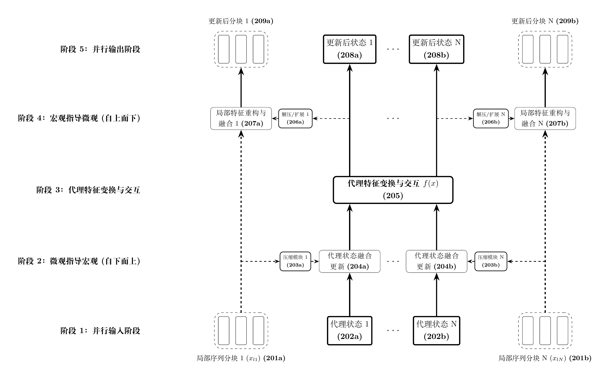
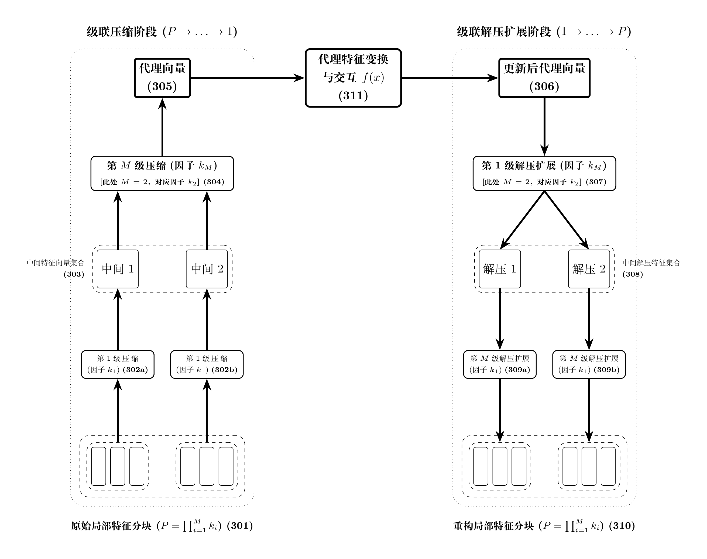
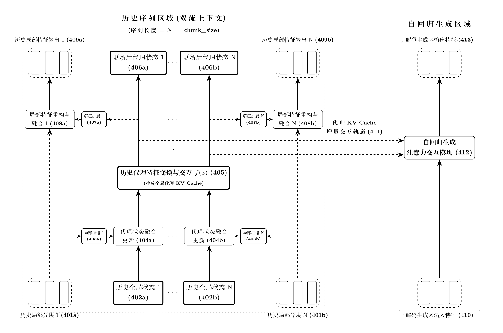
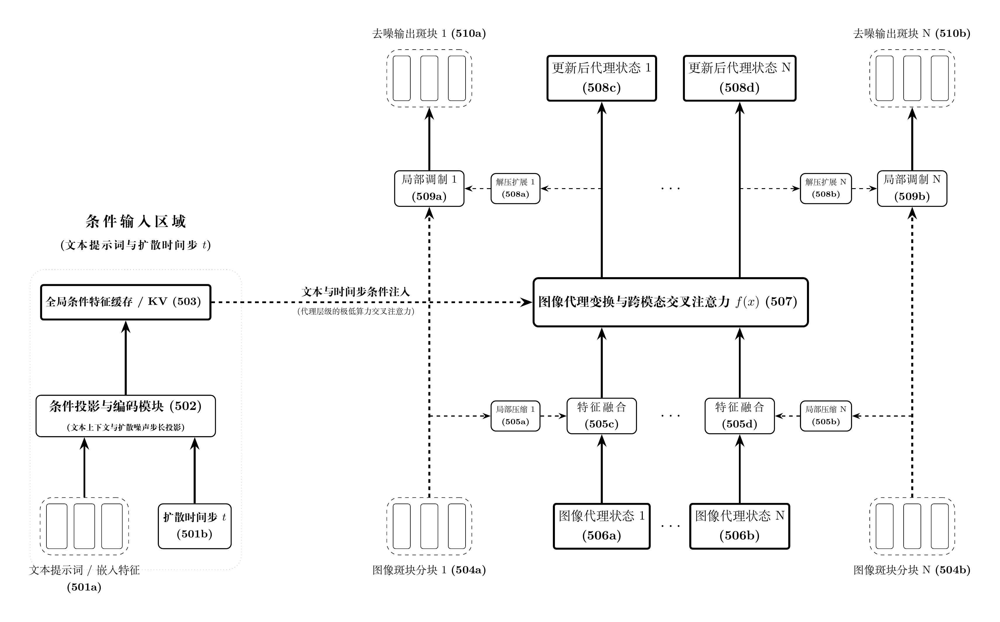

[English](README.md) | [简体中文](README_zh.md)

# ProxyFormer

> **用极短的“代理向量（Proxy Token）”承载全局交互，让超长序列与高分辨率生成在有限算力下成为可能。**

ProxyFormer 是一种面向超长序列、高分辨率乃至任意维度长特征处理的新型神经网络架构。它统一支持一维文本序列、二维图像、三维点云/体素/时空视频以及更高维张量，通过引入 **Proxy Token（代理向量）** 机制，将原始长序列/高分辨率/高维特征大幅压缩为极短的代理序列，并在代理特征空间内完成全局注意力交互，从而同时降低 **计算量** 与 **显存占用**，并天然支持 **代理级 KV Cache** 加速。整个架构只依赖重排、线性投影、卷积和标准注意力等常见算子，实现简单，不需要稀疏索引器或自定义 CUDA 内核。

> 🔗 源码仓库：<https://github.com/simonFelix-Ai/proxy-former.git>

本仓库用于验证 ProxyFormer 架构思想的可用性与工程可行性，包含：

- 超长上下文 **语言模型（LLM）** 训练与评测；
- **NIAH / 多针大海捞针** 长文本检索能力评测；
- **图像生成（JIT / JLT）** 的 Flow Matching 与自编码器训练；
- 资源占用对照实验（VRAM / 速度）；
- 统一的 YAML 配置化训练与评估流程。

---

## 目录

- [核心亮点](#核心亮点)
- [快速开始](#快速开始)
- [实验结果](#实验结果)
- [架构设计](#架构设计)
- [核心优势](#核心优势)
- [技术演化路径](#技术演化路径)
- [项目结构](#项目结构)
- [配置说明](#配置说明)
- [合作与联系](#合作与联系)
- [权利声明](#权利声明)

---

## 核心亮点

- 🚀 **百万级 Token 外推**：64K 训练模型可外推至 **1M（1,048,576）Tokens**，多针检索准确率保持 **92% ~ 95%**。
- ⚡ **超强泛化弹性**：8K 训练模型可直接外推至 **256K（32 倍）**，准确率 >94%。
- 🧠 **告别“迷失在中间”**：在 0% ~ 100% 深度区间均保持平稳一致的高召回率。
- 💾 **显存/算力双降**：压缩率为 `r` 时，全局注意力计算量降为原来的 `(1/r)^2`，历史激活与缓存占用降为原来的 `1/r`。
- ⚙️ **代理 KV Cache**：自回归解码时只需维护极短的代理历史状态，大幅降低推理显存与延迟。
- 🖼️ **视觉生成友好**：支持 JIT（直接像素生成）与 JLT（潜在空间生成）等范式。
- 🌐 **任意维度通用**：同一套分块—压缩—代理交互—解压机制，可迁移到文本、图像、点云、体素、视频及更高维张量。
- 🧩 **实现简单**：压缩/解压用重排、线性投影、卷积即可完成，代理交互直接复用标准注意力或 SSM，无需复杂索引器、块稀疏内核或专用 CUDA 算子。
- 📈 **参数扩展友好**：模块化解耦设计，可灵活调整压缩率、通道数与深度；通道扩容还能为进一步提高压缩率提供容量储备。

---

## 快速开始

### 环境安装

建议使用 Python 3.10 与 Conda：

```bash
conda create -n proxyformer python=3.10
conda activate proxyformer
pip install -r requirements.txt
```

### 数据说明

- LLM 默认使用 **Wikitext-103-v1**，图像默认使用 **CIFAR-10 / MNIST / Tiny ImageNet**。
- 首次运行时会通过 HuggingFace `datasets` 自动下载并缓存到 `out/dataset_cache/`。
- 你也可以修改 YAML 中的 `dataset_path` / `dataset_name` / `dataset_dir` 来使用本地数据。

### 权重与从零训练说明

- 训练/评估脚本默认从 `out/checkpoints/train/{experiment_name}/` 下加载权重（例如 `ar.pth`、`fm.pth`、`ae.pth`、`fm.pth.ema`）。
- 如果希望 **从 0 开始训练**，请先删除对应实验目录下的权重文件，例如：

```bash
rm -rf out/checkpoints/train/llm_proxy_former_chat_wiki
```

- 如果已有训练好的权重，请放到上述对应路径后直接运行评估。

> 注意：权重统一从本地 `out/checkpoints` 加载；如果仓库未附带预训练权重，请先完成对应训练，再进行评估。

### LLM 评测（WikiText PPL）

```bash
# ProxyFormer：有历史压缩
python eval.py --config configs/llm/proxy_former/eval/1-chat_with_history_nope.yaml

# ProxyFormer：无历史
python eval.py --config configs/llm/proxy_former/eval/2-chat_no_history_nope.yaml

# Base Decoder-only 对照
python eval.py --config configs/llm/base/eval/1-chat-nope.yaml
```

### LLM 训练

```bash
# ProxyFormer：先训练无历史，再训练带历史
python train.py --config configs/llm/proxy_former/train/1-chat_no_history.yaml
python train.py --config configs/llm/proxy_former/train/2-chat_with_history.yaml
python train.py --config configs/llm/proxy_former/train/3-chat_with_history_nope.yaml

# Base Decoder-only 对照
python train.py --config configs/llm/base/train/1-chat.yaml
python train.py --config configs/llm/base/train/2-chat-nope.yaml
```

### NIAH 长文本检索评测

以 8K 训练窗口的 ProxyFormer 为例，可以逐个长度评估：

```bash
python eval.py --config configs/niah/d_model_512/proxy_former/train_seq_len_8k/eval/histlen_8k_nkey_50_nope.yaml
...
```

64K 训练窗口同理：

```bash
python eval.py --config configs/niah/d_model_512/proxy_former/train_seq_len_64k/eval/histlen_8k_nkey_50_nope.yaml
...
```

> 仓库中还有更多 `histlen_*` 评测配置，可按需选择。

### NIAH 课程学习（重要）

长上下文训练需要 **循序渐进的课程学习（Curriculum Learning）**，直接面对长序列可能导致不收敛。推荐按配置编号从 1 到 4 依次训练，每个阶段 loss 接近 0 时再进入下一阶段。

8K 训练窗口：

```bash
python train.py --config configs/niah/d_model_512/proxy_former/train_seq_len_8k/train/1-boot-histlen_256_nkey_1.yaml
python train.py --config configs/niah/d_model_512/proxy_former/train_seq_len_8k/train/2-histlen_256_nkey_1.yaml
python train.py --config configs/niah/d_model_512/proxy_former/train_seq_len_8k/train/3-histlen_8k_nkey_50.yaml
python train.py --config configs/niah/d_model_512/proxy_former/train_seq_len_8k/train/4-histlen_8k_nkey_50_nope.yaml
```

64K 训练窗口：

```bash
python train.py --config configs/niah/d_model_512/proxy_former/train_seq_len_64k/train/1-boot-histlen_256_nkey_1.yaml
python train.py --config configs/niah/d_model_512/proxy_former/train_seq_len_64k/train/2-histlen_256_nkey_1.yaml
python train.py --config configs/niah/d_model_512/proxy_former/train_seq_len_64k/train/3-histlen_8k_nkey_50.yaml
python train.py --config configs/niah/d_model_512/proxy_former/train_seq_len_64k/train/4-histlen_64k_nkey_50_nope.yaml
```

### 图像生成

**JIT（Just Image Transformer，直接预测原始像素）**

```bash
# CIFAR-10
python train.py --config configs/img/cifar10/jit/fm.yaml

# MNIST
python train.py --config configs/img/mnist/jit/fm.yaml

# Tiny ImageNet
python train.py --config configs/img/tiny-imagenet/jit/fm.yaml
```

**JLT（Just Latent Transformer，先训练自编码器，再在潜在空间训练生成模型）**

```bash
# MNIST
python train.py --config configs/img/mnist/jlt/1-ae.yaml
python train.py --config configs/img/mnist/jlt/2-fm.yaml

# Tiny ImageNet
python train.py --config configs/img/tiny-imagenet/jlt/1-ae.yaml
python train.py --config configs/img/tiny-imagenet/jlt/2-fm.yaml
```

图像评估：

```bash
# MNIST JIT / JLT
python eval.py --config configs/img/mnist/jit/fm.yaml
python eval.py --config configs/img/mnist/jlt/2-fm.yaml

# CIFAR-10 JIT
python eval.py --config configs/img/cifar10/jit/fm.yaml
```

---

## 实验结果

> **关于 SOTA 的声明**：本开源仓库的核心目的是 **验证 ProxyFormer 架构思想的可用性与工程可行性**，并未冲击各大模型榜单的 SOTA。因此，该架构在极限算力下的真实上限仍有待探索。

### 图像生成评估

| 数据集 | 训练方法 | FID $\downarrow$ | IS $\uparrow$ |
| :--- | :---: | :---: | :---: |
| **cifar10** | JIT | 16.21 | 8.42 |
| **mnist** | JIT | 2.06 | 1.95 |
| **mnist** | JLT | 4.36 | 1.93 |

- JIT：Just Image Transformer，直接预测原始像素。
- JLT：Just Latent Transformer，预测潜在空间 `z`。

### LLM PPL 评测

数据集：Wikitext-103-v1，无位置编码。

| 架构 | 历史 | PPL |
| :--- | :---: | :---: |
| **base（decoder only）** | 无 | 21.36 |
| **proxy_former** | 无 | 22.10 |
| **proxy_former** | 有 | 21.01 |

### 长文本检索性能（多针大海捞针 / NIAH）

我们测试了模型在 **4K 到 1M（1,048,576）Tokens** 上下文下的超长距离信息检索能力。

> **测试协议**：在每个长度的大海文本中随机埋入 **50 组不同的 Passkey 针**（深度覆盖 0%~90%），重复 100 轮独立测试；对每篇文本中的 **全部 50 根针逐一发起提问并全量统计准确率**（单长度累计完成 $100 \times 50 = 5{,}000$ 次密集检索测试）。

| 8K 训练窗口外推效果 | 64K 训练窗口外推效果 |
| :---: | :---: |
|  |  |

核心结果：

- **100 万 Token 极限无损外推**：64K 训练模型在 16 倍外推至 **1M 长度** 下，全深度检索准确率依然保持 **92% ~ 95%**。
- **超强泛化弹性**：8K 训练模型可无损直接外推至 **256K（32 倍外推，准确率 >94%）**。
- **告别“迷失在中间”**：在 0% ~ 90% 各深度区间均保持平稳一致的高召回率。
- **低显存、高精度**：模型在显著削减 KV Cache 显存开销的同时，保持比肩甚至超越 Full-Attention 的长程记忆精度。

### 资源消耗对比

| 架构 | 历史长度 | 生成区长度 | VRAM 消耗 | 训练速度 |
| :--- | :---: | :---: | :---: | :---: |
| **标准 decoder only** | 0 | 20496 | 15.6 GB | 2.6 it/s |
| **base** | 20992 | 128 | 15.6 GB | 1.3 it/s |
| **proxy_former（压缩率 64）** | 20992 | 128 | 2.9 GB | 16.10 it/s |
| **proxy_former（压缩率 64）** | 716800 | 128 | 15.1 GB | 2.70 it/s |

> 测试基准：训练 batch size = 1，GPU 总显存 16GB。标准 decoder-only 与 base 架构仅支持约 20K 长度序列训练，而 ProxyFormer 可直接支持 0.7M 长度训练，可训练序列长度提升约 **35 倍**；相同序列长度下，ProxyFormer 训练速度也远超 base 模型。

---

## 架构设计

### 总体架构



模型将处理流程划分为六个阶段：

1. 对输入局部流进行 **分块**（文本块、图像斑块、体素块或高维张量块）；
2. 自下而上进行 **特征压缩**，提取高浓缩的“代理向量”；
3. 在高度压缩的 **代理空间** 内进行全局特征变换与注意力交互；
4. 完成代理级别的全局融合；
5. 自上而下 **解压与扩展**，将代理特征重新注入未压缩的局部流；
6. 输出融合了全局视野的局部特征流。

网络全程维护两条并行数据流：

- **细粒度局部序列分块**；
- **粗粒度代理状态**。

局部特征通过“微观指导宏观”更新代理状态；代理状态在顶层完成全局信息融合；再通过“宏观指导微观”将全局视野解压注入回局部特征。该设计在低计算负荷与高信息精度之间取得平衡。

### 多级级联因式分解压缩/解压



当需要极大压缩比（例如 $P = \prod_{i=1}^{M} k_i$）时，系统采用多级级联策略：原始分块经过 $M$ 级逐步压缩至代理向量，完成交互后，再通过对称的 $M$ 级级联解压还原。这使得架构可以处理几十万甚至上百万的极端长上下文。

### LLM 长上下文应用



在 LLM 长历史文本处理中，系统将冗长的上下文提炼为极度压缩的全局代理特征，构筑为微小的 **代理 KV Cache**。自回归解码时，当前 token 仅需与极短的代理 KV Cache 进行交叉注意力交互，打破长上下文对显存和解码速度的桎梏。

### 文生图 / 扩散模型应用



在文生图及条件生成任务中，左侧编码全局文本与时间步条件，右侧为图像双流处理。核心创新点是在代理空间进行 **极低算力的跨模态交叉注意力融合**：全局条件仅与压缩后的图像代理状态交互，而非密集的原始像素特征。

---

## 核心优势

### 从嵌入层即开始节省显存

与只在深度注意力层做优化的模型不同，ProxyFormer 在最初始的嵌入阶段即可大幅省流。以 LLM 实现（`src/models/architectures/llm/proxy_former_llm.py`）为例：

- 历史上下文使用远小于主干注意力维度的 `d_history` 进行嵌入映射（`h_embedding`）；
- 当前自回归输入使用全尺寸 `d_model`（`x_embedding`）。

这使得历史长序列在进入网络第一步时，显存占用就被大幅削减。

### 计算资源与显存占用双向锐减

假设序列压缩率为 `r`：

- **计算量降低**：全局交互阶段注意力计算量降为原来的 `(1/r)^2`；
- **显存需求下降**：与序列长度线性相关的激活值、中间状态等减少至原来的 `1/r`。

### 极致的代理 KV Cache

在自回归任务中，历史 token 的语义被高度凝聚在各块的 proxy token 中。解码阶段仅需维护极小的代理 KV Cache，无需存储海量原始历史状态，显著降低显存压力并提升单步推理速度。

### 以空间换通道，为进一步提高压缩率蓄力

借鉴视觉生成中 VAE 的训练直觉：将原始长序列（空间分辨率）大幅压缩后，把节省出的计算与显存资源转移给特征通道维度（增大 `d_model` / `d_proxy`），从而提升代理 token 的信息承载力与非线性拟合能力。

进一步看，这里存在一个可复利的“再投资”机制：若压缩率从 `r` 增大到 `αr`，代理序列长度降为原来的 `1/α`，代理注意力算力变为原来的 `1/α²`；若同时把代理通道维度增大为原来的 `β` 倍，则代理注意力算力变为原来的 `β/α²`。只要 `β ≤ α²`，总注意力预算就不会增加，但每个代理向量能携带更多信息。也就是说：**序列轴压缩得越狠，省下的算力越多；省下的算力可以投入通道轴，而更强的通道表达力又允许我们进一步加大压缩率。**

### 实现简单，无需复杂索引器

与需要维护块稀疏索引、局部窗口索引或自定义注意力内核的高效 Transformer 变体不同，ProxyFormer 的核心操作都可以由常见深度学习原语直接实现：

- 分块与压缩：`reshape` / `rearrange` + `Linear`，或一维/二维/三维 `Conv`；
- 代理交互：直接调用标准因果/双向 `SDPA`，或替换为现成 SSM/RNN 模块；
- 解压与注入：`Linear` + 逆重排，或 `ConvTranspose`；
- 代理 KV Cache：缓存长度仅为 `L/P` 的代理 K/V，不需要新的注意力算子。

这意味着 ProxyFormer 可以方便地在 PyTorch 等主流框架中复现、修改和部署，也更有利于后续扩展到三维卷积、点云分组或高维张量场景。

### 支持不同层、不同序列长度的动态压缩比例

由于维护了微观的低维完整状态，不同层可以方便地配置不同压缩比例；对更久远的历史，也可以配置不同的压缩比例。

### 参数扩展性与硬件友好

高度解耦的模块化设计支持灵活调整压缩率和通道维度，在相同消费级/企业级 GPU 算力限制下，可以训练层数更深、参数量更大的超长上下文 LLM 或高分辨率视觉生成模型。

---

## 技术演化路径

ProxyFormer 的诞生源于以下研究直觉的交汇：

1. **降低空间/序列长度是可行的**
   - [TLinformer](doc/paper/TLinformer.pdf)（[arXiv:2508.20407](https://arxiv.org/abs/2508.20407)）
   - [TConstFormer](doc/paper/TConstFormer.pdf)（[arXiv:2509.00202](https://arxiv.org/abs/2509.00202)）
   - 局限：固定长度 token 吸收全局信息时，对不同长短上下文不够灵活，优化困难，极长序列训练仍吃力。

2. **近乎无损的序列压缩**
   - [Compression is Routing](doc/paper/Compression-is-Routing.pdf)（[arXiv:2512.16963](https://arxiv.org/abs/2512.16963)）
   - 验证了形状为 `[B, 512, 512]` 的特征序列可近乎无损地压缩为 `[B, 8, 512]`，重建恢复精度高达 99.47%。

3. **空间换通道表达力**
   - 图像 VAE 等模型的训练经验表明：缩小空间维度、增大通道维度，可有效提升非线性表达能力。
   - 对 ProxyFormer 而言，压缩率越高，代理序列越短，越有条件把算力预算重新投入到代理通道，从而为进一步加大压缩率提供容量。

基于上述事实，ProxyFormer 的核心理念是：**将 N 个局部原始信息压缩为一个代理 token，后续高耗时注意力交互完全在短小精悍的代理 token 之间进行**。

---

## 项目结构

```text
.
├── configs/
│   ├── llm/                 # LLM 训练 / 评测配置
│   ├── img/                 # 图像生成 JIT / JLT 配置
│   ├── niah/                # 大海捞针长上下文评测与课程训练配置
│   └── vram_usage/          # 显存 / 速度对照实验配置
├── doc/
│   ├── img/                 # 架构图与 NIAH 热力图
│   ├── paper/               # 相关论文 PDF
├── scripts/                 # 辅助脚本（部分为历史脚本）
├── src/
│   ├── dataset/             # 数据加载：Wiki、随机、Passkey、HF 图像
│   ├── evaluator/           # 评估：PPL、NIAH、图像 FID/IS
│   ├── models/
│   │   ├── architectures/   # LLM / 图像生成模型
│   │   └── components/      # Transformer、位置编码、FFN 等
│   ├── tokenizer/           # GPT2 / MiniMind 分词器
│   ├── trainer/             # 训练器：AR、Image AE、Image FM
│   ├── utils/               # 配置、优化器、通用工具
│   └── weights/             # 预训练权重下载辅助
├── train.py                 # 统一训练入口
├── eval.py                  # 统一评估入口
├── requirements.txt
└── LICENSE.md
```

---

## 配置说明

本项目使用 YAML 配置文件驱动训练与评估，入口脚本会根据配置中的模块名动态加载对应实现：

- `train.py` 读取 `training.module` 与 `training.func`；
- `eval.py` 读取 `eval.module` 与 `eval.func`；
- 模型、数据、分词器、优化器、硬件等均在 YAML 中声明。

常用配置项示例：

```yaml
ar_model:
  module: "src.models.architectures.llm.proxy_former_llm"
  class_name: "ArLLM"
  d_model: 512
  d_history: 64
  chunk_size: 128
  layer_compress_ratio: [32, 32, 32, 32, 32, 32, 32, 32, 32, 32]

data:
  module: "src.dataset.data_loader_wiki"
  class_name: "data_loader_wiki"
  history_enable: true
  retain_chunks: 1

training:
  module: "src.trainer.train_ar"
  func: "train"
  per_device_train_batch_size: 64
  gradient_accumulation: 16

hardware:
  device: "cuda"
  autocast: true
  compile: true
```

如果显存不足，可尝试：

- 降低 `per_device_train_batch_size`；
- 增大 `gradient_accumulation`；
- 减小 `history_len` 或调整 `chunk_size` / `layer_compress_ratio`。

---

## 合作与联系

作为一个经济条件并不宽裕的独立研究者，作者希望探究该架构的极限，但受限于个人精力与算力条件，难以推进更纵深的研究。如果您或您的机构认可该架构的潜力，并愿意提供以下任何形式的帮助，欢迎联系：

- **算力资源支援**
- **研发资金赞助**
- **深度研发合作**

📧 **tangzhongp@qq.com**

---

## 权利声明

作者热衷于开源生态，并希望将这一架构最大程度地分享给学术社区。为了在支持学术开放与维持长期可持续研发之间取得平衡，作者已对核心架构申请专利保护。

**代理向量（Proxy Token）方法已正式提交相关专利申请（专利申请中 / Patent Pending）。**
- 本项目采用 **学术与非商业研究许可**（见 [LICENSE.md](LICENSE.md)）：代码与模型权重对非商业学术研究、论文复现及教学活动免费开放。
- **商业化说明**：商业化部署、企业内部盈利性研发或产品集成不包含在默认开源许可内。如有商业落地意向，欢迎通过邮件联系作者洽谈商业授权与合作。
- 商务合作联系：tangzhongp@qq.com